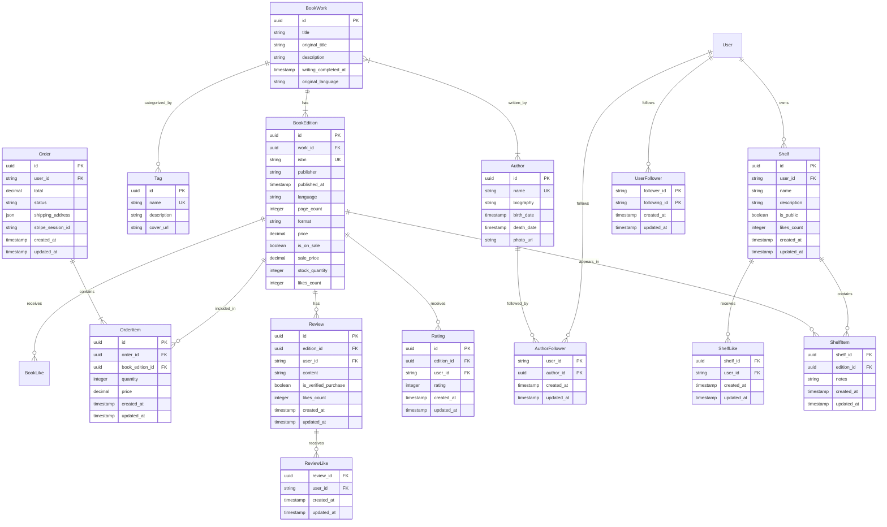
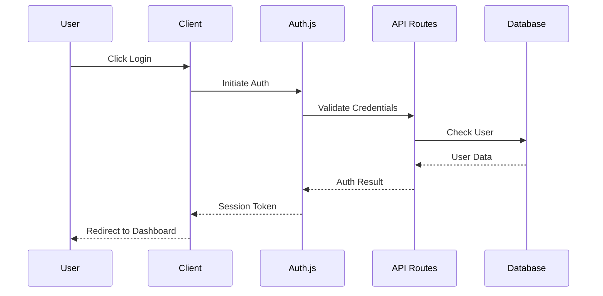
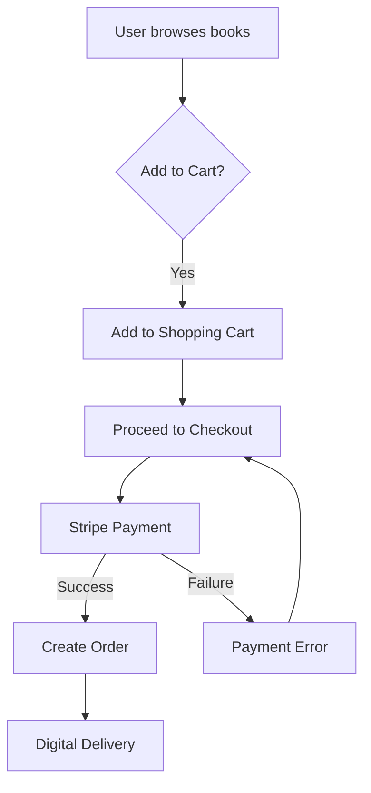
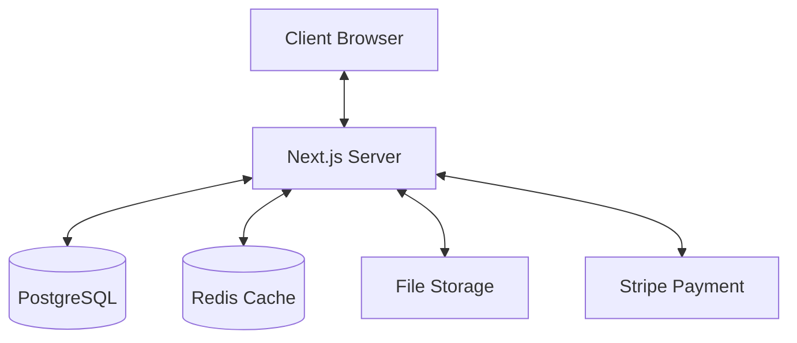

# BookHeaven - Architecture Documentation

## Overview

BookHeaven is a modern, full-stack digital book marketplace and library management system built with Next.js 14. It provides a comprehensive platform for users to discover, purchase, and manage their digital book collections.

## Features

- 📚 Book Management
  - Book listings with advanced search and filtering
  - Detailed book pages with metadata, previews, and reviews
  - ISBN-based book search
  - Book categorization and tagging system

- 👥 User Management
  - User authentication and authorization
  - Personal bookshelves
  - Reading history and preferences
  - Social features (following authors, sharing reviews)

- ✍️ Author Platform
  - Author profiles and portfolios
  - Book publishing and management
  - Author analytics and insights

- 🛒 E-commerce
  - Shopping cart functionality
  - Secure payment processing via Stripe
  - Order management and history
  - Digital content delivery

- 📱 User Experience
  - Responsive design
  - Dark/Light theme support
  - Real-time updates
  - Optimistic UI updates

- 👨‍💼 Admin Dashboard
  - Content management
  - User management
  - Order processing
  - Analytics and reporting

## Tech Stack

### Frontend
- **Framework**: Next.js 14 with App Router
- **Language**: TypeScript
- **Styling**: Tailwind CSS + shadcn/ui components
- **State Management**: React Query + Context API
- **Forms**: React Hook Form
- **Validation**: Zod
- **Testing**: Vitest + React Testing Library

### Backend
- **Runtime**: Node.js
- **API**: Next.js API Routes + Server Actions
- **Database**: PostgreSQL with Drizzle ORM
- **Authentication**: Auth.js (NextAuth)
- **File Storage**: UploadThing
- **Payment Processing**: Stripe

### DevOps & Infrastructure
- **Version Control**: Git
- **CI/CD**: (placeholder for CI/CD details)
- **Containerization**: Docker
- **Development**: pnpm package manager

## Project Structure

```
bookheaven/
├── app/                    # Next.js 14 app directory
│   ├── actions/           # Server actions
│   ├── api/              # API routes
│   ├── sections/         # Page sections
│   └── [routes]/         # App routes
├── components/           # React components
│   ├── admin/           # Admin dashboard components
│   ├── authors/         # Author-related components
│   ├── books/           # Book-related components
│   ├── ui/              # Reusable UI components
│   └── providers/       # Context providers
├── db/                  # Database configuration and migrations
├── hooks/              # Custom React hooks
├── lib/                # Utility functions and types
├── public/             # Static assets
└── scripts/            # Development and deployment scripts
```

## Database Schema

The database is implemented using PostgreSQL with Drizzle ORM, featuring a sophisticated schema design that separates book metadata from physical editions:

### Core Tables



### Key Features

1. **Book Work vs Edition Separation**
   - BookWork: Represents the intellectual property (story/content)
   - BookEdition: Represents specific published versions (formats/editions)

2. **Comprehensive Metadata**
   - Rich book details including ISBN, format, language
   - Price management with sale support
   - Stock tracking for physical editions

3. **Order Management**
   - Complete order history with status tracking
   - Integration with Stripe payment processing
   - Detailed order items with quantity and pricing
   - Shipping information storage

4. **Social Features**
   - Book likes tracking
   - Author following system
   - Review and rating system

5. **Advanced Indexing**
   - Full-text search capabilities
   - Efficient querying with strategic indexes
   - Performance-optimized joins

## Authentication Flow



## Core Features Workflow

### Book Purchase Flow




## Data Flow Architecture



## API Structure

- **/api/books/** - Book management endpoints
- **/api/authors/** - Author management endpoints
- **/api/users/** - User management endpoints
- **/api/orders/** - Order processing endpoints
- **/api/payments/** - Payment processing endpoints
- **/api/webhook/** - External service webhooks
- **/api/uploadthing/** - File upload endpoints

## Performance Optimizations

1. **Static Generation**
   - Pre-rendered static pages where possible
   - Incremental Static Regeneration for dynamic content
   - Static metadata optimization

2. **Data Fetching**
   - React Query for efficient data caching
   - Optimistic updates for better UX
   - Parallel data fetching with Suspense

3. **Image Optimization**
   - Next.js Image component usage
   - Automatic image optimization
   - Lazy loading implementation

4. **Code Splitting**
   - Automatic code splitting
   - Dynamic imports for large components
   - Route-based code splitting

## Security Measures

1. **Authentication & Authorization**
   - Auth.js (NextAuth) implementation
   - Role-based access control
   - JWT token management

2. **Data Protection**
   - Input validation with Zod
   - SQL injection prevention via Drizzle
   - XSS protection
   - CSRF tokens

3. **API Security**
   - Rate limiting
   - Request validation
   - Secure headers
   - CORS configuration


## Monitoring and Analytics

1. **Performance Monitoring**
   - Server-side metrics
   - Client-side performance
   - API endpoint monitoring
   - Database query performance

2. **Error Tracking**
   - Error boundary implementation
   - Server-side error logging
   - Client-side error tracking

3. **Business Analytics**
   - User behavior tracking
   - Sales analytics
   - Author performance metrics
   - Content engagement metrics

## Development Workflow

1. **Local Development**
   - Docker development environment
   - Hot reloading
   - Development database
   - Test data seeding

2. **Testing Strategy**
   - Unit tests with Vitest
   - Integration tests
   - End-to-end testing
   - Visual regression testing


## Scalability Considerations

1. **Database Scaling**
   - Connection pooling
   - Query optimization
   - Indexing strategy
   - Sharding possibilities

2. **Application Scaling**
   - Horizontal scaling
   - Load balancing
   - Caching strategies
   - Microservices potential

3. **Content Delivery**
   - CDN utilization
   - Edge caching
   - Global deployment
